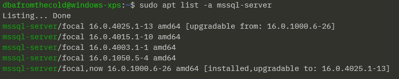

# SQL Server on Linux

---

## Andrew Pruski

### Field Solutions Architect
#### Microsoft Data Platform MVP
#### Docker Captain
#### VMware vExpert

<!-- .slide: style="text-align: left;"> -->
<i class="fab fa-twitter"></i><a href="https://twitter.com/dbafromthecold">  @dbafromthecold</a> 
<i class="fas fa-envelope"></i>  dbafromthecold@gmail.com 
<i class="fab fa-wordpress"></i>  www.dbafromthecold.com 
<i class="fab fa-github"></i><a href="https://github.com/dbafromthecold">  github.com/dbafromthecold</a>

---

## Session Aim
<!-- .slide: style="text-align: left;"> -->
To provide an overview of SQL Server on Linux

---

  

---

## How it works
<!-- .slide: style="text-align: left;"> -->

The SQL Platform Abstraction Layer (SQLPAL)
- Introduced in SQL Server 2017
- Combination of project Drawbridge and the SQLOS
- Acts as a bridge between SQLOS and the host OS
- Prevented significant changes to the SQL codebase

<a href="https://cloudblogs.microsoft.com/sqlserver/2016/12/16/sql-server-on-linux-how-introduction/">https://cloudblogs.microsoft.com/sqlserver/2016/12/16/sql-server-on-linux-how-introduction/</a>

---

## Supported Platforms
<!-- .slide: style="text-align: left;"> -->

  

---

## Installation
<!-- .slide: style="text-align: left;"> -->

<pre><code data-line-numbers="1|3|5|7|9">sudo apt update && sudo apt upgrade
	
wget -qO- https://packages.microsoft.com/keys/microsoft.asc | sudo apt-key add -

sudo add-apt-repository "$(wget -qO- https://packages.microsoft.com/config/ubuntu/20.04/mssql-server-2022.list)"

sudo apt update

sudo apt install -y mssql-server</code></pre>
 
Unattended installation
 
<pre><code>sudo MSSQL_PID=Developer ACCEPT_EULA=Y MSSQL_SA_PASSWORD='Testing1122' /opt/mssql/bin/mssql-conf -n setup</code></pre>

---

## List SQL versions available
<!-- .slide: style="text-align: left;"> -->

<pre><code>sudo apt list -a mssql-server</code></pre>

  

Install specific version

<pre><code>sudo apt install -y mssql-server=16.0.1000.6-26</code></pre>

Installs SQL Server 2022 RTM

---

## Configuration
<!-- .slide: style="text-align: left;"> -->

<pre><code>/opt/mssql/bin/mssql-conf</code></pre>

<pre><code>sudo /opt/mssql/bin/mssql-conf set sqlagent.enabled true</code></pre>

  

<a href="https://learn.microsoft.com/en-us/sql/linux/sql-server-linux-configure-mssql-conf">https://learn.microsoft.com/en-us/sql/linux/sql-server-linux-configure-mssql-conf</a>

---

## Service
<!-- .slide: style="text-align: left;"> -->
<pre><code>systemctl status mssql-server</code></pre>

  

---

## Prevent accidental upgrade
<!-- .slide: style="text-align: left;"> -->

<pre><code data-line-numbers="1|3">sudo apt-mark hold mssql-server

sudo apt-mark unhold mssql-server</code></pre>

---

## Upgrade
<!-- .slide: style="text-align: left;"> -->

<pre><code>sudo apt install -y mssql-server=16.0.4003.1-1</code></pre>

Upgrades to SQL Server 2022 CU1

After Upgrade

  

---

## Rollback
<!-- .slide: style="text-align: left;"> -->

<pre><code data-line-numbers="1|3">sudo apt install -y mssql-server=16.0.1000.6-26 --allow-downgrades

sudo systemctl start mssql-server</code></pre>

Rolls back to SQL Server 2022 RTM

---

# Demo

---

# Further Configuration
<!-- .slide: style="text-align: left;"> -->

---

## Active Directory
<!-- .slide: style="text-align: left;"> -->

Steps to perform: -
- Join host to AD domain
- Create AD user for SQL Server and set SPN
- Create and secure SQL Server service keytab file
- Configure SQL Server to use keytab file

<a href="https://learn.microsoft.com/en-us/sql/linux/sql-server-linux-active-directory-authentication">https://learn.microsoft.com/en-us/sql/linux/sql-server-linux-active-directory-authentication</a>

---

## High availability
<!-- .slide: style="text-align: left;"> -->
Three options available: -
- Availability Groups
- Failover Cluster Instances
- Log shipping

Mirroring is not supported

<a href="https://learn.microsoft.com/en-us/sql/linux/sql-server-linux-ha-basics">https://learn.microsoft.com/en-us/sql/linux/sql-server-linux-ha-basics</a>

---

## Pacemaker cluster
<!-- .slide: style="text-align: left;"> -->

  

---

# Demo

---

# Containers

---

## Containers
<!-- .slide: style="text-align: left;"> -->
"Containers wrap a piece of software in a complete filesystem that contains everything needed to run: code, runtime, system tools, system libraries, anything that can be installed on a server. This guarantees that the software will always run the same, regardless of its environment."
<a href="https://www.docker.com/what-docker ">https://www.docker.com/what-docker</a>

---

## Running a SQL Server Container
<!-- .slide: style="text-align: left;"> -->
<pre><code language="bash" data-line-numbers="1|2|3-4|5|6">docker container run -d
--publish 15789:1433
--env ACCEPT_EULA=Y
--env MSSQL_SA_PASSWORD=Testing1122
--name sqlcontainer1
mcr.microsoft.com/mssql/server:2022-CU3-ubuntu-20.04
</pre></code>

---

# Demo

---

# Chaos Engineering?

---

### What is Chaos Engineering?
<!-- .slide: style="text-align: left;"> -->
"Chaos Engineering is the discipline of experimenting on a system in order to build confidence in the system's capability to withstand turbulent conditions in production" 
<a href="principlesofchaos.org">principlesofchaos.org</a>

---

### Netflix - Chaos Monkey
<!-- .slide: style="text-align: left;"> -->

"Chaos Monkey is responsible for randomly terminating instances in production to ensure that engineers implement their services to be resilient to instance failures" 
<a href="netflix.github.io/chaosmonkey/">netflix.github.io/chaosmonkey</a>

---

### Running Experiments

- Use the scientific method
- Start as narrow as possible
- Set up proper monitoring
- Have a rollback plan
- Use whatever tools you are comfortable with!

---

### KubeInvaders

---

## Resources
<!-- .slide: style="text-align: left;"> -->
<a href="https://github.com/dbafromthecold/sqlserverlinux">https://github.com/dbafromthecold/sqlserverlinux/</a> 

  

