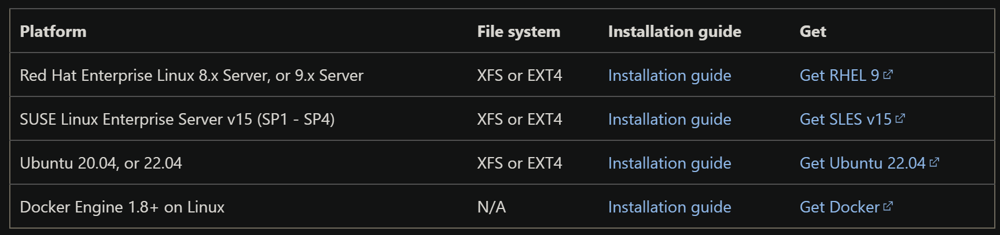

# SQL Server on Linux

---

## Andrew Pruski

### Field Solutions Architect
### Microsoft Data Platform MVP

<!-- .slide: style="text-align: left;"> -->
<i class="fab fa-twitter"></i><a href="https://twitter.com/dbafromthecold">  @dbafromthecold</a> 
<i class="fas fa-envelope"></i>  dbafromthecold@gmail.com 
<i class="fab fa-wordpress"></i>  www.dbafromthecold.com 
<i class="fab fa-github"></i><a href="https://github.com/dbafromthecold">  github.com/dbafromthecold</a>

---

## Session Aim
<!-- .slide: style="text-align: left;"> -->
To provide an overview of SQL Server on Linux

---

  

---

## Supported Platforms
<!-- .slide: style="text-align: left;"> -->

  

---

## Installation
<!-- .slide: style="text-align: left;"> -->

<pre><code data-line-numbers="1|3|5|7|9">sudo apt update && sudo apt upgrade
	
wget -qO- https://packages.microsoft.com/keys/microsoft.asc | sudo apt-key add -

sudo add-apt-repository "$(wget -qO- https://packages.microsoft.com/config/ubuntu/20.04/mssql-server-2022.list)"

sudo apt update

sudo apt install -y mssql-server</code></pre>

---

## Unattended installation
<!-- .slide: style="text-align: left;"> -->

<pre><code>sudo MSSQL_PID=Developer ACCEPT_EULA=Y MSSQL_SA_PASSWORD='Testing1122' /opt/mssql/bin/mssql-conf -n setup</code></pre>

---

## List SQL versions available
<!-- .slide: style="text-align: left;"> -->

<pre><code>sudo apt list -a mssql-server</code></pre>

  

---

## Install specific version
<!-- .slide: style="text-align: left;"> -->

<pre><code>sudo apt install -y mssql-server=16.0.1000.6-26</code></pre>
 
Installs SQL Server 2022 RTM

---

## Configuration
<!-- .slide: style="text-align: left;"> -->

<pre><code>/opt/mssql/bin/mssql-conf</code></pre>

<a href="https://learn.microsoft.com/en-us/sql/linux/sql-server-linux-configure-mssql-conf">https://learn.microsoft.com/en-us/sql/linux/sql-server-linux-configure-mssql-conf</a>

---

## Service
<!-- .slide: style="text-align: left;"> -->
<pre><code>systemctl status mssql-server</code></pre>

  

---

## Service Configuration
<!-- .slide: style="text-align: left;"> -->

---

# Demo

---

## Prevent accidental upgrade
<!-- .slide: style="text-align: left;"> -->

<pre><code data-line-numbers="1|3">sudo apt-mark hold mssql-server

sudo apt-mark unhold mssql-server</code></pre>

---

## Upgrade
<!-- .slide: style="text-align: left;"> -->

<pre><code>sudo apt install -y mssql-server=16.0.4003.1-1</code></pre>
 
Upgrades to SQL Server 2022 CU1

---

## After Upgrade
<!-- .slide: style="text-align: left;"> -->

  

---

## Rollback
<!-- .slide: style="text-align: left;"> -->

<pre><code data-line-numbers="1|3">sudo apt install -y mssql-server=16.0.1000.6-26 --allow-downgrades

sudo systemctl start mssql-server</code></pre>
 
Rolls back to SQL Server 2022 RTM

---

# Demo

---

## Active Directory

---

## High availability

---

# Demo

---

## Containers

---

## Resources

